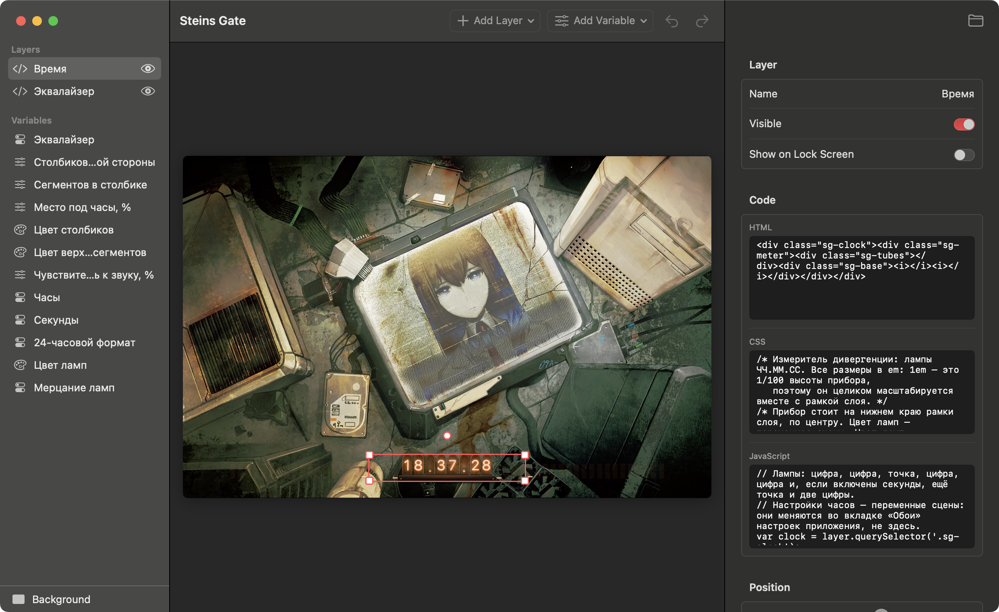

# WallAero Engine
**English** · [Русский](README.ru.md)

Live wallpapers for macOS: videos, GIFs and pictures on your desktop — beneath icons and windows, on every Space and every display. Plus animated cursors from Windows cursor packs.

<p align="center">
  
</p>

## Features

- **Formats:** MP4, MOV, M4V (H.264/HEVC), GIF, APNG, animated WebP and HEICS, plus still PNG, JPEG, HEIC and WebP.
- **GIFs and other animated images** are converted to H.264 once, on import. From then on they play through the hardware decoder like any other video, which is far more efficient than playing a GIF frame by frame. Small GIFs are scaled up by a whole number without smoothing, so pixel art stays crisp.
- **Multiple displays:** one wallpaper on every screen or a different one on each; you can also turn it off on a single display.
- **Energy saving:** playback pauses when the desktop is completely covered by windows or a full-screen app, while displays sleep and while the screen is locked. Optionally also on battery power and in Low Power Mode. Video never keeps the display awake.
- **Scenes and an editor:** turn any video or picture into a scene and shape it in a visual editor: a clock and the date, text, pictures, shapes, background effects, and layers with your own HTML, CSS and JavaScript. See [Scenes](#scenes).
- **Web wallpapers:** a folder with an `index.html` is shown as a wallpaper. Web wallpapers made for Wallpaper Engine work too.
- **Reacting to sound:** an equalizer in a scene moves to whatever your Mac is playing: a song in any app, a video in the browser. See [Reacting to sound](#reacting-to-sound).
- **Your own music:** listen to your own songs in place of the video's sound. Pick a folder in Settings: its subfolders and `.m3u` files become playlists. With no folder chosen, the sound comes from the video. See [Music](#music).
- **Cursors:** Windows cursor packs (`.ani`, `.cur`) replace the pointer across the whole system, animation included. Which file becomes which pointer is read from the pack's `install.inf`. See [Cursors](#cursors).
- **Controls:** a menu bar icon (pause, next wallpaper, quick pick), a library window with drag and drop, and Open With → WallAero Engine in Finder.
- **Settings of every wallpaper:** scaling (fill / fit / stretch), which part stays in view when filling crops the picture, and speed. A scene adds the settings its author put up for changing.
- **Settings of the app:** sound and volume, open at login, and the first frame as the regular macOS wallpaper (shown on the lock screen and in Mission Control).
- **Interface language:** English or Russian, following the system language; any other language gets English. To change it for WallAero Engine alone, go to System Settings → General → Language & Region → Applications.

## Installation

A ready-made build is in the repository: [**download WallAeroEngine.zip**](https://github.com/M1nata1/WallAero-Engine/raw/main/dist/WallAeroEngine.zip). It runs on Macs with Apple silicon or Intel processors and needs macOS 13 Ventura or later.

1. Unzip the archive and drag WallAero Engine to your Applications folder.
2. Open the app. It is not notarized by Apple, so on first launch macOS stops it and says it cannot verify it. Close that message.
3. Open System Settings → Privacy & Security, click Open Anyway near the bottom and confirm with your password. You only have to do this once.

Updating from AiWallpaper, as the app used to be called? Just open WallAero Engine: on first launch it moves your library, settings and cursor backups over. Turn "Open at login" on again in Settings, then delete the old AiWallpaper app.

Instead of steps 2–3, you can remove the quarantine flag in Terminal; the app then opens without any warning:

```bash
xattr -dr com.apple.quarantine "/Applications/WallAero Engine.app"
```

## Building from source

You need Xcode 15 or later and macOS 13 Ventura or later. With only the Command Line Tools (Swift 5.9+), universal builds are not available — use `--native`.

For the look of macOS 26, build with Xcode 26: macOS shows it only to apps built with its SDK. Older tools build the app too, and macOS 26 then draws it the way earlier systems do.

The app is universal: macOS runs the version for its own processor, Apple silicon or Intel.

```bash
scripts/build.sh              # build "build/WallAero Engine.app" for Apple silicon and Intel
scripts/build.sh --install    # build and copy to /Applications
scripts/build.sh --dist       # build and pack into dist/WallAeroEngine.zip, the download above
scripts/build.sh --native     # this Mac's processor only: twice as fast, for development
swift test                    # import, conversion and cursor-reading tests
scripts/screenshots.sh        # retake the README screenshots in both languages in docs/screenshots
```

The app is signed ad hoc, so a copy built on your own Mac opens right away, without a warning.

`swift run WallAeroEngine` and an editor's Run button start the program without the app around it. That is enough to try a change, but its settings are kept apart from the app's, and macOS takes it for a different program when it asks for permissions.

## Usage

1. Launch WallAero Engine — the first time, it opens an empty library.
2. Drag files or folders into the window, or click + in the toolbar.
3. Double-click a wallpaper (or click Set as Wallpaper), and it is on your desktop.

The settings are at the side of the same window; the gear button hides and shows them, and ⌘, opens the app's own. They have two tabs. Wallpaper is about the wallpaper selected in the library: its preview, the button that opens it in the editor, its scaling, position and speed, and the [variables](#scenes) of a scene. General holds the app's own settings. Everything else is in the menu bar icon. While its windows are closed, the app takes no space in the Dock.

## Music

Open Settings → General → Playback → Music folder and pick a folder with your songs. Sound turns on by itself, and the music takes the place of the video's sound.

- **Playlists.** Every subfolder with music in it is a playlist, and so is every `.m3u` or `.m3u8` file. In Settings you choose one playlist or All Music. Songs lying directly in the chosen folder play only under All Music.
- **Order.** Songs play in order, around and around. Shuffle plays them in random order: each one once before any repeats.
- **Formats:** MP3, M4A, AAC, WAV, AIFF and FLAC. A file that cannot be opened is skipped.
- **Next Track** is in the menu bar icon's menu, which also shows the song that is playing.
- **Pausing.** Music keeps playing while windows cover the desktop. It pauses together with the wallpaper: on Pause in the menu, while the screen is locked or the displays sleep and, if you turned those on, on battery power and in Low Power Mode. Without a wallpaper chosen, music does not play. With the volume all the way down nothing plays either, and the music goes on from the same place when you turn it up.
- **Back to the video's sound:** click Remove next to the folder.

## Scenes

<p align="center">
  
</p>

A scene is a wallpaper made of a background and layers on top of it. Select a video or a picture in the library and click Edit as Scene… in its settings at the side. The app makes a scene with that video as its background and opens the editor. The original wallpaper stays as it was.

- **Layers:** text, image, shape and code. Drag a layer right in the preview, pull its corners to resize it, and turn it by the round handle above it. A layer snaps to the middle of the screen. The arrow keys move it by 0.1%, or by 1% with Shift.
- **Text** understands placeholders: `{HH}:{mm}` is the time, `{date}` is "October 7", `{weekday}` is the day of the week, `{year}` is the year. The full list: `{HH}` `{H}` `{hh}` `{h}` `{mm}` `{ss}` `{ampm}` `{weekday}` `{date}` `{day}` `{dd}` `{month}` `{MM}` `{year}` `{yy}`.
- **Background:** a video, a picture or a color. Videos and pictures can be blurred and have their brightness, contrast, saturation and hue changed.
- **Every layer** has a position, a size, a rotation, an opacity, a blending mode, a shadow and an animation: pulse, float, spin or blink.
- **A code layer** holds any HTML, CSS and JavaScript inside the layer's box. Its script gets the variables `layer` (the layer's element) and `scene` (the whole scene).
- **Variables.** Add Variable puts a value up for changing without the editor: a color, a number with limits, a switch, a text or a list of options. It shows in the wallpaper's settings under the title you give it, and the scene reads it by its name in code: `var(--name)` in CSS, `wallaero.variables.name` in JavaScript, `{name}` in a text layer. A change shows on the desktop at once; a script can follow it with the `wallaero:variables` event.
- **Lock screen.** With "Use the first frame as the macOS wallpaper" on, the lock screen shows a still picture of the scene, on which a clock would be stuck at one time. Every layer has a Show on Lock Screen switch: turn it off and the layer is left out of that picture.
- **Saving.** Changes are saved by themselves and show on the desktop at once if the scene is the current wallpaper. ⌘Z undoes, ⇧⌘Z redoes.

A scene is an ordinary web page. The folder button in the editor's toolbar opens its files:

```
scene.json    the scene itself; the editor reads and writes only this
index.html    the page — generated by the app
runtime.js    turns scene.json into the page — generated by the app
custom.css    your own styles, loaded after the scene's
custom.js     your own script, run after the scene is built
media/        the background and the layers' pictures
```

The app rewrites `index.html` and `runtime.js` when it updates, so put your own code in `custom.css`, `custom.js` or a code layer. Edit the files in any editor: the wallpaper on the desktop updates when you save.

### Reacting to sound

A scene or a web wallpaper can move to the sound your Mac is playing: a song in any app, a video in the browser, the app's own music. The first time such a wallpaper is shown, macOS asks whether WallAero Engine may record system audio — click Allow. The app only measures how loud the low, middle and high notes are at each moment. Nothing is recorded or sent anywhere.

In a code layer or in `custom.js`, register a listener, the same way as in Wallpaper Engine:

```js
window.wallpaperRegisterAudioListener(levels => {
  const bass = Math.max(levels[4], levels[68]);   // the same band of the left and the right channel
  layer.style.transform = `scale(${1 + bass * 0.2})`;
});
```

About thirty times a second the listener gets 128 numbers from 0 to 1: 64 bands of the left channel, then 64 of the right, low notes first. The levels adjust to how loud the source is, so a quiet video moves the bars as much as a loud song does. In silence every number is 0.

- **To turn it off,** go to Settings → General → Playback → Wallpapers react to sound. Listeners are no longer called, and a layer can go back to moving on its own.
- **If you clicked Don't Allow** and the bars lie flat, open System Settings → Privacy & Security → Screen & System Audio Recording and turn WallAero Engine on under System Audio Recording Only.
- The Mac's sound is listened to only while such a wallpaper is playing on screen: not while it is paused or covered by windows, and never for wallpapers that do not ask for it.
- This needs macOS 14.2 or later. On older systems the listener is never called.

### Web wallpapers

A folder with an `index.html` in it can be added to the library as a wallpaper: drag it into the window. Web wallpapers made for Wallpaper Engine (a folder with a `project.json`) are added the same way; the title, the preview and the default values of the settings are taken from it.

- Wallpaper Engine's Scene and Video wallpapers are not supported: the former are stored in a closed format, the latter are easier to add as plain videos.
- Audio visualizers follow the sound your Mac is playing, see [Reacting to sound](#reacting-to-sound). The rest of Wallpaper Engine's media API (the track's title, cover and position) is not there.
- Scenes and web wallpapers use more energy and memory than plain video: they are drawn by the web engine built into macOS. Plain videos keep taking the direct route. While paused, the page stands completely still.

## Cursors

<p align="center">
  
</p>

WallAero Engine applies cursor packs made for Windows — like Mousecape, but with no manual conversion: the app turns `.ani` and `.cur` files into the macOS format by itself.

1. Unpack the cursor pack into a folder — it usually contains `.ani` / `.cur` files and an `install.inf`.
2. Open Settings → General → Cursor → Choose Folder…. The cursors show up in the preview, already animated.
3. Click Apply and move the mouse.

If the pack has an `install.inf`, the mapping comes from it. Both common layouts are supported: one line per cursor in `[Wreg]`, and a single scheme list (`Control Panel\Cursors\Schemes`). Without an `install.inf`, cursors are matched by file name (`Normal`, `Text`, `Busy`, `Link`, `Help` and so on). One Windows cursor can replace several macOS cursors at once:

| Cursor in the pack | Where it appears in macOS |
|---|---|
| `Arrow` | the regular arrow |
| `IBeam` | the text cursor |
| `Hand` | the hand over links; the make-alias arrow while dragging |
| `Wait` | busy |
| `AppStarting` | the arrow with a background-activity indicator |
| `Crosshair` | crosshairs in apps; the camera over a window when capturing a window (⌘⇧4, then Space) |
| `No` | "not allowed" while dragging |
| `SizeNS`, `SizeWE`, `SizeNWSE`, `SizeNESW` | resizing: window edges and corners, split-view dividers, the Dock divider |
| `SizeAll` | move, open hand and closed hand |
| `Help` | the arrow with a question mark |

`NWPen` (handwriting), `UpArrow` (alternate select), `Person` and `Pin` have no macOS equivalent, so such files are not applied.

Good to know:

- The pointer size is the system one: System Settings → Accessibility → Display → Pointer size.
- macOS shows at most 24 frames of a cursor animation. Longer animations are thinned out evenly, keeping the length of the loop.
- Cursors are replaced through an undocumented CoreGraphics API — the same one Mousecape uses. No system files are modified and SIP stays on. The original cursors are saved before they are replaced, so Reset brings back exactly them.
- The chosen pack is remembered: after a restart or a new login, WallAero Engine applies it again when it launches. If the pointer ever looks wrong, just restart the app or click Reset.
- If macOS puts its own cursors back by itself, for example after sleep or a display change, WallAero Engine notices within a few seconds and puts the pack's cursors back.
- macOS 26 draws the arrow and the text cursor from new system cursors (`ArrowS`, `IBeamS`). WallAero Engine themes them as well as the older ones.
- For window screenshots (⌘⇧4, then Space), the pack's crosshair is shown in place of the camera: Windows packs have no camera cursor.

The same from Terminal:

```bash
swift run cursorctl check "<folder>"   # show which file goes to which cursor, without changing anything
swift run cursorctl apply "<folder>"   # apply a pack
swift run cursorctl status             # show what is applied
swift run cursorctl verify "<folder>"  # list the pack's cursors macOS has replaced with its own
swift run cursorctl reset              # bring back the system cursors
```

## How it works

Each display gets a borderless window at desktop level (`kCGDesktopWindowLevel`): above the system wallpaper but below Finder icons and ordinary windows. The window lets clicks through, is present on every Space and is not hidden by ⌘H. Video plays through `AVQueuePlayer` + `AVPlayerLooper` — a seamless loop without reloading the file.

Scenes and web wallpapers are shown by a `WKWebView` in the same window. A scene is stored as `scene.json`, and a small script, `runtime.js`, builds the page from it; the editor shows that same page and adds selecting and dragging on top. While paused, the web view hides behind a snapshot of itself: a hidden page stops its videos, animations and timers.

Cursors are registered with the WindowServer through undocumented CoreGraphics functions (`CGSRegisterCursorWithImages` and its neighbours). The frames of an `.ani` are taken from its embedded `.cur` images at the largest size and passed as a single vertical strip — the form in which the WindowServer accepts an animated cursor.

```
Sources/
  WallpaperCore/          import, GIF → H.264 conversion, thumbnails, library, music, scenes (no UI, covered by tests)
  CursorCore/             reading .ani/.cur and install.inf, applying and resetting cursors (covered by tests)
  CGSCursor/              Swift declarations of the undocumented cursor API (C)
  cursorctl/              command-line tool for cursors
  WallAeroEngine/
    Engine/               desktop windows, players, web wallpapers, pause logic
    UI/                   menu bar, library window, settings, scene editor (SwiftUI)
    AppDelegate.swift     launch, main menu, opening files
    ScreenshotMode.swift  taking the README screenshots (--screenshots)
Tests/                    WallpaperCore and CursorCore tests
Resources/                Info.plist, icon, translations
scripts/                  building the .app, drawing the icon, screenshots
docs/screenshots/         README screenshots: en/ and ru/
dist/                     the ready-made build to download (scripts/build.sh --dist)
```

The library is kept in `~/Library/Application Support/WallAeroEngine`: imported files are copies, so you can move or delete the originals. The saved system cursors are kept there too, in `CursorBackup`.

Playback log:

```bash
log stream --predicate 'subsystem == "com.fadevec.WallAeroEngine"'
```

## Limitations

- macOS cannot play WebM, MKV or AVI out of the box — convert them to MP4 (H.264 or HEVC), for example with HandBrake.
- Live wallpapers do not play on the lock screen: macOS does not let third-party apps show anything there. The first frame is shown instead if "Use the first frame as the macOS wallpaper" is on.
