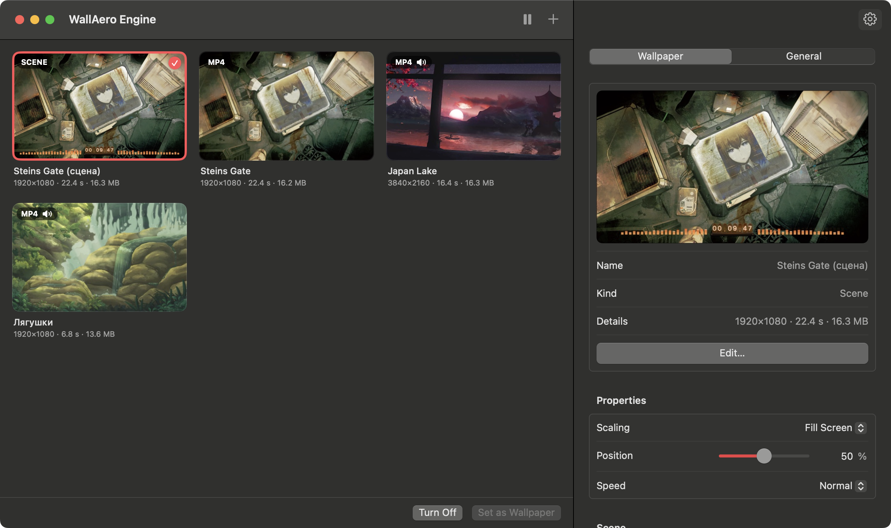
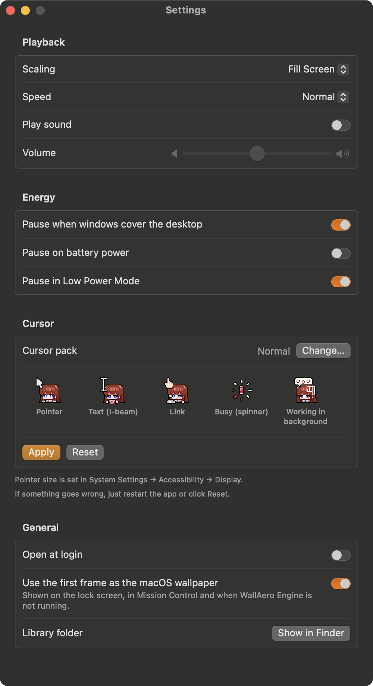

# WallAero Engine
**English** · [Русский](README.ru.md)

Live wallpapers for macOS: videos, GIFs and pictures on your desktop — beneath icons and windows, on every Space and every display. Plus animated cursors from Windows cursor packs.

<p align="center">
  
</p>

## Features

- **Formats:** MP4, MOV, M4V (H.264/HEVC), GIF, APNG, animated WebP and HEICS, plus still PNG, JPEG, HEIC and WebP.
- **GIFs and other animated images** are converted to H.264 once, on import. From then on they play through the hardware decoder like any other video, which is far more efficient than playing a GIF frame by frame. Small GIFs are scaled up by a whole number without smoothing, so pixel art stays crisp.
- **Multiple displays:** one wallpaper on every screen or a different one on each; you can also turn it off on a single display.
- **Energy saving:** playback pauses when the desktop is completely covered by windows or a full-screen app, while displays sleep and while the screen is locked. Optionally also on battery power and in Low Power Mode. Video never keeps the display awake.
- **Cursors:** Windows cursor packs (`.ani`, `.cur`) replace the pointer across the whole system, animation included. Which file becomes which pointer is read from the pack's `install.inf`. See [Cursors](#cursors).
- **Controls:** a menu bar icon (pause, next wallpaper, quick pick), a library window with drag and drop, and Open With → WallAero Engine in Finder.
- **Settings:** scaling (fill / fit / stretch), speed, sound and volume, open at login, and the first frame as the regular macOS wallpaper (shown on the lock screen and in Mission Control).
- **Interface language:** English or Russian, following the system language; any other language gets English. To change it for WallAero Engine alone, go to System Settings → General → Language & Region → Applications.

## Installation

A ready-made build is in the repository: [**download WallAeroEngine.zip**](https://github.com/M1nata1/AiWallpaper/raw/main/dist/WallAeroEngine.zip). It runs on Macs with Apple silicon or Intel processors and needs macOS 13 Ventura or later.

1. Unzip the archive and drag WallAero Engine to your Applications folder.
2. Open the app. It is not notarized by Apple, so on first launch macOS stops it and says it cannot verify it. Close that message.
3. Open System Settings → Privacy & Security, click Open Anyway near the bottom and confirm with your password. You only have to do this once.

Updating from AiWallpaper, as the app used to be called? Just open WallAero Engine: on first launch it moves your library, settings and cursor backups over. Turn "Open at login" on again in Settings, then delete the old AiWallpaper app.

Instead of steps 2–3, you can remove the quarantine flag in Terminal; the app then opens without any warning:

```bash
xattr -dr com.apple.quarantine "/Applications/WallAero Engine.app"
```

## Building from source

You need Xcode 15 or later and macOS 13 Ventura or later. With only the Command Line Tools (Swift 5.9+), universal builds are not available — use `--native`.

The app is universal: macOS runs the version for its own processor, Apple silicon or Intel.

```bash
scripts/build.sh              # build "build/WallAero Engine.app" for Apple silicon and Intel
scripts/build.sh --install    # build and copy to /Applications
scripts/build.sh --dist       # build and pack into dist/WallAeroEngine.zip, the download above
scripts/build.sh --native     # this Mac's processor only: twice as fast, for development
swift test                    # import, conversion and cursor-reading tests
scripts/screenshots.sh        # retake the README screenshots in both languages in docs/screenshots
```

The app is signed ad hoc, so a copy built on your own Mac opens right away, without a warning.

## Usage

1. Launch WallAero Engine — the first time, it opens an empty library.
2. Drag files or folders into the window, or click Add….
3. Double-click a wallpaper (or click Set as Wallpaper), and it is on your desktop.

Everything else is in the menu bar icon. While its windows are closed, the app takes no space in the Dock.

## Cursors

<p align="center">
  
</p>

WallAero Engine applies cursor packs made for Windows — like Mousecape, but with no manual conversion: the app turns `.ani` and `.cur` files into the macOS format by itself.

1. Unpack the cursor pack into a folder — it usually contains `.ani` / `.cur` files and an `install.inf`.
2. Open Settings → Cursor → Choose Folder…. The cursors show up in the preview, already animated.
3. Click Apply and move the mouse.

If the pack has an `install.inf`, the mapping comes from it. Both common layouts are supported: one line per cursor in `[Wreg]`, and a single scheme list (`Control Panel\Cursors\Schemes`). Without an `install.inf`, cursors are matched by file name (`Normal`, `Text`, `Busy`, `Link`, `Help` and so on). One Windows cursor can replace several macOS cursors at once:

| Cursor in the pack | Where it appears in macOS |
|---|---|
| `Arrow` | the regular arrow |
| `IBeam` | the text cursor |
| `Hand` | the hand over links; the make-alias arrow while dragging |
| `Wait` | busy |
| `AppStarting` | the arrow with a background-activity indicator |
| `Crosshair` | crosshairs, including the screenshot one (⌘⇧4) |
| `No` | "not allowed" while dragging |
| `SizeNS`, `SizeWE`, `SizeNWSE`, `SizeNESW` | resizing: window edges and corners, split-view dividers, the Dock divider |
| `SizeAll` | move, open hand and closed hand |
| `Help` | the arrow with a question mark |

`NWPen` (handwriting), `UpArrow` (alternate select), `Person` and `Pin` have no macOS equivalent, so such files are not applied.

Good to know:

- The pointer size is the system one: System Settings → Accessibility → Display → Pointer size.
- macOS shows at most 24 frames of a cursor animation. Longer animations are thinned out evenly, keeping the length of the loop.
- Cursors are replaced through an undocumented CoreGraphics API — the same one Mousecape uses. No system files are modified and SIP stays on. The original cursors are saved before they are replaced, so Reset brings back exactly them.
- The chosen pack is remembered: after a restart or a new login, WallAero Engine applies it again when it launches. If the pointer ever looks wrong, just restart the app or click Reset.
- If macOS puts its own cursors back by itself, for example after sleep or a display change, WallAero Engine notices within a few seconds and puts the pack's cursors back.
- macOS 26 draws the arrow and the text cursor from new system cursors (`ArrowS`, `IBeamS`). WallAero Engine themes them as well as the older ones.
- The camera pointer for window screenshots (⌘⇧4, then Space) stays the system one: Windows packs have no such cursor.

The same from Terminal:

```bash
swift run cursorctl check "<folder>"   # show which file goes to which cursor, without changing anything
swift run cursorctl apply "<folder>"   # apply a pack
swift run cursorctl status             # show what is applied
swift run cursorctl verify "<folder>"  # list the pack's cursors macOS has replaced with its own
swift run cursorctl reset              # bring back the system cursors
```

## How it works

Each display gets a borderless window at desktop level (`kCGDesktopWindowLevel`): above the system wallpaper but below Finder icons and ordinary windows. The window lets clicks through, is present on every Space and is not hidden by ⌘H. Video plays through `AVQueuePlayer` + `AVPlayerLooper` — a seamless loop without reloading the file.

Cursors are registered with the WindowServer through undocumented CoreGraphics functions (`CGSRegisterCursorWithImages` and its neighbours). The frames of an `.ani` are taken from its embedded `.cur` images at the largest size and passed as a single vertical strip — the form in which the WindowServer accepts an animated cursor.

```
Sources/
  WallpaperCore/          import, GIF → H.264 conversion, thumbnails, library (no UI, covered by tests)
  CursorCore/             reading .ani/.cur and install.inf, applying and resetting cursors (covered by tests)
  CGSCursor/              Swift declarations of the undocumented cursor API (C)
  cursorctl/              command-line tool for cursors
  WallAeroEngine/
    Engine/               desktop windows, players, pause logic
    UI/                   menu bar, library window, settings (SwiftUI)
    AppDelegate.swift     launch, main menu, opening files
    ScreenshotMode.swift  taking the README screenshots (--screenshots)
Tests/                    WallpaperCore and CursorCore tests
Resources/                Info.plist, icon, translations
scripts/                  building the .app, drawing the icon, screenshots
docs/screenshots/         README screenshots: en/ and ru/
dist/                     the ready-made build to download (scripts/build.sh --dist)
```

The library is kept in `~/Library/Application Support/WallAeroEngine`: imported files are copies, so you can move or delete the originals. The saved system cursors are kept there too, in `CursorBackup`.

Playback log:

```bash
log stream --predicate 'subsystem == "com.fadevec.WallAeroEngine"'
```

## Limitations

- macOS cannot play WebM, MKV or AVI out of the box — convert them to MP4 (H.264 or HEVC), for example with HandBrake.
- Live wallpapers do not play on the lock screen: macOS does not let third-party apps show anything there. The first frame is shown instead if "Use the first frame as the macOS wallpaper" is on.
