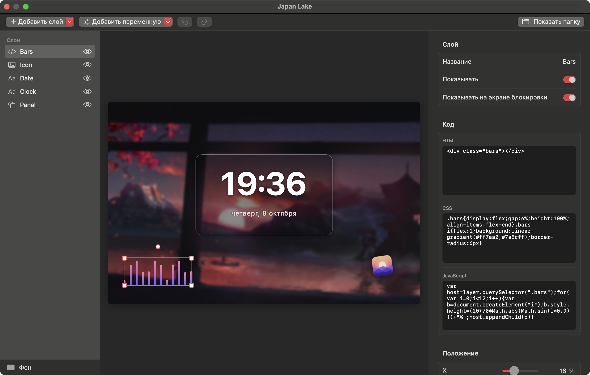

# WallAero Engine
[English](README.md) · **Русский**

Живые обои для macOS: видео, GIF и картинки на рабочем столе — под иконками и окнами, на всех рабочих столах (Spaces) и дисплеях. А ещё — анимированные курсоры из наборов для Windows.

<p align="center">
  
</p>

## Возможности

- **Форматы:** MP4, MOV, M4V (H.264/HEVC), GIF, APNG, анимированный WebP, HEICS, а также статичные PNG, JPEG, HEIC, WebP.
- **GIF и другие анимированные картинки** при импорте один раз перекодируются в H.264. Дальше они играют аппаратным декодером, как обычное видео, — это намного экономнее покадрового воспроизведения GIF. Маленькие GIF увеличиваются в целое число раз без сглаживания, поэтому пиксель-арт остаётся чётким.
- **Несколько дисплеев:** одни обои на все экраны или свои на каждый, можно выключить на отдельном дисплее.
- **Экономия энергии:** воспроизведение останавливается, когда рабочий стол полностью закрыт окнами или полноэкранным приложением, во время сна дисплеев и блокировки экрана. По желанию — от аккумулятора и в режиме энергосбережения. Видео не мешает дисплею засыпать.
- **Сцены и редактор:** любое видео или картинку можно превратить в сцену и настроить в визуальном редакторе: часы и дата, текст, картинки, фигуры, эффекты фона и слои с собственным HTML, CSS и JavaScript. Подробнее — в разделе [«Сцены»](#сцены).
- **Веб-обои:** папка с `index.html` показывается как обои. Подходят и веб-обои, сделанные для Wallpaper Engine.
- **Реакция на звук:** эквалайзер в сцене двигается под то, что играет на Mac: песню в любом приложении, видео в браузере. Подробнее — в разделе [«Реакция на звук»](#реакция-на-звук).
- **Своя музыка:** вместо звука видео можно слушать свои песни. Укажите папку в настройках: вложенные папки и файлы `.m3u` станут плейлистами. Если папка не выбрана, звук берётся из видео. Подробнее — в разделе [«Музыка»](#музыка).
- **Курсоры:** наборы курсоров для Windows (`.ani`, `.cur`) заменяют указатель во всей системе, вместе с анимацией. Какой файл какому состоянию соответствует, берётся из `install.inf` набора. Подробнее — в разделе [«Курсоры»](#курсоры).
- **Управление:** иконка в строке меню (пауза, следующие обои, быстрый выбор), окно библиотеки с drag-and-drop, «Открыть в программе → WallAero Engine» из Finder.
- **Настройки у каждых обоев:** масштаб (заполнить / вписать / растянуть), какая часть кадра остаётся видна, когда при заполнении он обрезается, и скорость. У сцены к ним добавляются настройки, которые вынес её автор.
- **Настройки приложения:** звук и громкость, запуск при входе в систему, первый кадр как обычные обои macOS (виден на экране блокировки и в Mission Control).
- **Язык интерфейса** — русский или английский, выбирается по языку системы. Для остальных языков включается английский. Только для WallAero Engine язык можно сменить в «Системные настройки» → «Основные» → «Язык и регион» → «Приложения».

## Установка

Готовая сборка лежит в репозитории: [**скачать WallAeroEngine.zip**](https://github.com/M1nata1/WallAero-Engine/raw/main/dist/WallAeroEngine.zip). Она подходит для Mac с Apple Silicon и Intel, нужна macOS 13 Ventura или новее.

1. Распакуйте архив и перетащите WallAero Engine в папку «Программы».
2. Откройте приложение. Оно не нотаризовано Apple, поэтому при первом запуске macOS его остановит и сообщит, что не может его проверить. Закройте это окно.
3. Откройте «Системные настройки» → «Конфиденциальность и безопасность», внизу нажмите «Все равно открыть» и подтвердите паролем. Это нужно сделать только один раз.

Раньше приложение называлось AiWallpaper. Если оно у вас стояло, просто откройте WallAero Engine: при первом запуске библиотека, настройки и резервные копии курсоров перенесутся сами. Затем снова включите «Открывать при входе в систему» в настройках и удалите старое приложение AiWallpaper.

Вместо шагов 2–3 можно снять карантин в Терминале — тогда приложение сразу откроется без предупреждения:

```bash
xattr -dr com.apple.quarantine "/Applications/WallAero Engine.app"
```

## Сборка из исходников

Нужен Xcode 15 или новее и macOS 13 Ventura или новее. С одними Command Line Tools (Swift 5.9+) универсальная сборка недоступна — используйте `--native`.

Готовое приложение универсальное: macOS сама запускает версию для своего процессора — Apple Silicon или Intel.

```bash
scripts/build.sh              # собрать "build/WallAero Engine.app" для Apple Silicon и Intel
scripts/build.sh --install    # собрать и скопировать в /Applications
scripts/build.sh --dist       # собрать и упаковать в dist/WallAeroEngine.zip — архив для скачивания
scripts/build.sh --native     # только для процессора этого Mac: вдвое быстрее, для разработки
swift test                    # тесты импорта, конвертации и чтения курсоров
scripts/screenshots.sh        # переснять скриншоты для README на обоих языках в docs/screenshots
```

Приложение подписывается ad hoc, поэтому собранное на этом Mac запускается сразу, без предупреждения.

## Как пользоваться

1. Запустите WallAero Engine — при первом запуске откроется пустая библиотека.
2. Перетащите в окно файлы или папки либо нажмите «Добавить…».
3. Двойной щелчок по обоям (или «Установить как обои») — и они на рабочем столе.

Настройки находятся сбоку в том же окне; кнопка с шестерёнкой скрывает и показывает их, а ⌘, открывает настройки приложения. В них две вкладки. «Обои» — про обои, выбранные в библиотеке: превью, кнопка, которая открывает их в редакторе, масштаб, положение кадра, скорость и [переменные](#сцены) сцены. «Общие» — настройки самого приложения. Остальное доступно из иконки в строке меню. При закрытом окне приложение не занимает место в Dock.

## Музыка

Откройте «Настройки» → «Общие» → «Воспроизведение» → «Папка с музыкой» и выберите папку со своими песнями. Звук включится сам, а музыка заменит звук видео.

- **Плейлисты.** Каждая вложенная папка с музыкой — плейлист, файл `.m3u` или `.m3u8` — тоже. В настройках можно выбрать один плейлист или «Вся музыка». Песни, которые лежат прямо в выбранной папке, играют только в режиме «Вся музыка».
- **Порядок.** Песни идут по порядку и по кругу. «Перемешивать» ставит их в случайном порядке: каждая играет один раз, прежде чем какая-то повторится.
- **Форматы:** MP3, M4A, AAC, WAV, AIFF и FLAC. Файл, который не открывается, пропускается.
- **Следующий трек** — в меню значка в строке меню. Там же видно название песни, которая играет сейчас.
- **Пауза.** Музыка не останавливается, когда окна закрывают рабочий стол. На паузу она встаёт вместе с обоями: по «Пауза» в меню, при блокировке экрана и сне дисплеев, а если включено — при работе от аккумулятора и в режиме энергосбережения. Без выбранных обоев музыка не играет. При нулевой громкости тоже ничего не играет, а когда громкость прибавят, музыка продолжится с того же места.
- **Вернуть звук видео:** нажмите «Убрать» рядом с папкой.

## Сцены

<p align="center">
  
</p>

Сцена — это обои из фона и слоёв поверх него. Выделите в библиотеке видео или картинку и нажмите «Редактировать как сцену…» в настройках сбоку. Приложение создаст сцену, в которой это видео станет фоном, и откроет редактор. Исходные обои останутся как были.

- **Слои:** текст, изображение, фигура и код. Слой можно перетаскивать прямо в предпросмотре, тянуть за углы, чтобы изменить размер, и поворачивать за круглую ручку сверху. К середине экрана слой притягивается. Стрелки на клавиатуре двигают его на 0,1 %, с Shift — на 1 %.
- **Текст** понимает подстановки: `{HH}:{mm}` — время, `{date}` — «7 октября», `{weekday}` — день недели, `{year}` — год. Полный список: `{HH}` `{H}` `{hh}` `{h}` `{mm}` `{ss}` `{ampm}` `{weekday}` `{date}` `{day}` `{dd}` `{month}` `{MM}` `{year}` `{yy}`.
- **Фон:** видео, картинка или цвет. Для видео и картинки — размытие, яркость, контраст, насыщенность и оттенок.
- **У каждого слоя** есть положение, размер, поворот, непрозрачность, режим наложения, тень и анимация: пульсация, парение, вращение или мерцание.
- **Слой «Код»** — любые HTML, CSS и JavaScript внутри рамки слоя. Скрипту доступны переменные `layer` (элемент слоя) и `scene` (вся сцена).
- **Переменные.** «Добавить переменную» выносит значение в настройки обоев, чтобы менять его без редактора: цвет, число с границами, переключатель, текст или список вариантов. В настройках обоев оно показано под названием, которое вы зададите, а сцена читает его по имени в коде: `var(--имя)` в CSS, `wallaero.variables.имя` в JavaScript, `{имя}` в текстовом слое. Изменение сразу видно на рабочем столе; скрипт может следить за ним по событию `wallaero:variables`.
- **Экран блокировки.** Если включено «Использовать первый кадр как обои macOS», на экране блокировки видна неподвижная картинка сцены, и часы на ней застыли бы на одном времени. У каждого слоя есть переключатель «Показывать на экране блокировки»: выключите его, и на этой картинке слоя не будет.
- **Сохранение.** Правки сохраняются сами и сразу видны на рабочем столе, если сцена выбрана обоями. ⌘Z отменяет действие, ⇧⌘Z возвращает.

Сцена — обычная веб-страница. Кнопка «Показать папку» открывает её файлы:

```
scene.json    сама сцена; редактор читает и пишет только её
index.html    страница — создаётся приложением
runtime.js    превращает scene.json в страницу — создаётся приложением
custom.css    ваши стили: подключаются после стилей сцены
custom.js     ваш скрипт: запускается после построения сцены
media/        фон и картинки слоёв
```

`index.html` и `runtime.js` приложение перезаписывает, когда обновляется, поэтому свой код пишите в `custom.css`, `custom.js` или в слое «Код». Файлы можно править в любом редакторе: обои на рабочем столе обновляются при сохранении.

### Реакция на звук

Сцена или веб-обои могут двигаться под звук, который играет на Mac: песню в любом приложении, видео в браузере, музыку самого WallAero Engine. Когда такие обои показываются впервые, macOS спрашивает, можно ли WallAero Engine записывать системный звук, — нажмите «Разрешить». Приложение только измеряет, насколько громко в каждый момент звучат низкие, средние и высокие ноты. Звук не записывается и никуда не отправляется.

В слое «Код» или в `custom.js` зарегистрируйте обработчик — так же, как в Wallpaper Engine:

```js
window.wallpaperRegisterAudioListener(levels => {
  const bass = Math.max(levels[4], levels[68]);   // одна и та же полоса левого и правого канала
  layer.style.transform = `scale(${1 + bass * 0.2})`;
});
```

Примерно тридцать раз в секунду обработчик получает 128 чисел от 0 до 1: 64 полосы левого канала, затем 64 правого, от низких нот к высоким. Уровни подстраиваются под громкость источника: тихое видео двигает столбики так же, как громкая песня. В тишине все числа равны 0.

- **Чтобы выключить,** откройте «Настройки» → «Общие» → «Воспроизведение» → «Обои реагируют на звук». Обработчики перестают вызываться, и слой может снова двигаться сам.
- **Если вы нажали «Не разрешать»** и столбики лежат внизу, откройте «Системные настройки» → «Конфиденциальность и безопасность» → «Запись экрана и системного звука» и включите WallAero Engine в списке «Только запись системного звука».
- Звук Mac прослушивается, только пока такие обои играют на экране: на паузе и под окнами — нет, а для обоев, которым звук не нужен, — никогда.
- Нужна macOS 14.2 или новее. В более старых системах обработчик не вызывается.

### Веб-обои

Папку, в которой лежит `index.html`, можно добавить в библиотеку как обои: перетащите её в окно. Так же добавляются веб-обои, сделанные для Wallpaper Engine (папка с `project.json`): из неё берутся название, превью и значения настроек по умолчанию.

- Обои Wallpaper Engine типов Scene и Video не поддерживаются: первые хранятся в закрытом формате, вторые проще добавить как обычное видео.
- Визуализаторы звука следуют за тем, что играет на Mac, см. [«Реакция на звук»](#реакция-на-звук). Остального из медиа-API Wallpaper Engine (название трека, обложка, позиция) нет.
- Сцены и веб-обои расходуют больше энергии и памяти, чем обычное видео: их рисует встроенный браузер macOS. Обычные видео идут прежним прямым путём. На паузе страница полностью замирает.

## Курсоры

<p align="center">
  
</p>

WallAero Engine ставит наборы курсоров, сделанные для Windows, — как Mousecape, только без ручной конвертации: `.ani` и `.cur` приложение переводит в формат macOS само.

1. Распакуйте набор в папку — обычно в ней лежат файлы `.ani` / `.cur` и `install.inf`.
2. Откройте «Настройки» → «Общие» → «Курсор» → «Выбрать папку…». Курсоры появятся в превью сразу с анимацией.
3. Нажмите «Применить» и подвигайте мышью.

Если в наборе есть `install.inf`, соответствие берётся из него. Поддерживаются оба распространённых вида: построчные записи в `[Wreg]` и общий список схемы (`Control Panel\Cursors\Schemes`). Без `install.inf` курсоры подбираются по именам файлов (`Normal`, `Text`, `Busy`, `Link`, `Help` и т. п.). Один курсор Windows может заменить сразу несколько курсоров macOS:

| Курсор в наборе | Где появится в macOS |
|---|---|
| `Arrow` | обычная стрелка |
| `IBeam` | текстовый курсор |
| `Hand` | рука над ссылками, стрелка создания псевдонима при перетаскивании |
| `Wait` | ожидание |
| `AppStarting` | стрелка с индикатором фоновой работы |
| `Crosshair` | прицел в приложениях; камера над окном при снимке окна (⌘⇧4, затем пробел) |
| `No` | «нельзя» при перетаскивании |
| `SizeNS`, `SizeWE`, `SizeNWSE`, `SizeNESW` | изменение размера: края и углы окон, разделители, граница Dock |
| `SizeAll` | перемещение, раскрытая и сжатая рука |
| `Help` | стрелка со знаком вопроса |

Для `NWPen` (рукописный ввод), `UpArrow` (альтернативный выбор), `Person` и `Pin` аналогов в macOS нет, поэтому такие файлы не применяются.

Что стоит знать:

- Размер указателя задаётся штатно: «Системные настройки» → «Универсальный доступ» → «Дисплей» → «Размер указателя».
- macOS показывает не больше 24 кадров анимации курсора. Более длинные анимации равномерно прореживаются, длительность цикла сохраняется.
- Курсоры заменяются через недокументированный API CoreGraphics — тот же, которым пользуется Mousecape. Системные файлы не меняются, отключать SIP не нужно. Перед заменой оригиналы сохраняются, поэтому «Сбросить» возвращает именно их.
- Выбранный набор запоминается: после перезагрузки или нового входа в систему WallAero Engine применяет его снова при запуске. Если с курсором что-то не так, просто перезапустите приложение или нажмите «Сбросить».
- Если macOS сама вернёт стандартные курсоры, например после пробуждения или смены мониторов, WallAero Engine заметит это в течение нескольких секунд и снова поставит курсоры из набора.
- В macOS 26 стрелка и текстовый курсор берутся из новых системных курсоров (`ArrowS`, `IBeamS`). WallAero Engine заменяет и их, и прежние.
- При снимке окна (⌘⇧4, затем пробел) вместо камеры показывается прицел из набора: камеры в наборах для Windows нет.

То же из терминала:

```bash
swift run cursorctl check "<папка>"   # показать, какой файл на какой курсор встанет, ничего не меняя
swift run cursorctl apply "<папка>"   # применить набор
swift run cursorctl status            # что применено сейчас
swift run cursorctl verify "<папка>"  # какие курсоры набора macOS подменила своими
swift run cursorctl reset             # вернуть системные курсоры
```

## Как это устроено

Для каждого дисплея создаётся окно без рамки на уровне рабочего стола (`kCGDesktopWindowLevel`): выше системных обоев, но ниже иконок Finder и обычных окон. Окно пропускает клики, присутствует на всех Spaces и не скрывается по ⌘H. Видео играет через `AVQueuePlayer` + `AVPlayerLooper` — бесшовный цикл без перезагрузки файла.

Сцены и веб-обои показывает `WKWebView` в том же окне. Сцена хранится как `scene.json`, а страницу из неё строит небольшой скрипт `runtime.js`; редактор показывает ту же страницу и добавляет к ней выделение и перетаскивание. На паузе веб-представление прячется за собственным снимком: скрытая страница останавливает видео, анимации и таймеры.

Курсоры регистрируются в WindowServer недокументированными функциями CoreGraphics (`CGSRegisterCursorWithImages` и соседними). Кадры `.ani` извлекаются из вложенных `.cur` в самом крупном разрешении и передаются одной вертикальной лентой — в таком виде WindowServer принимает анимированный курсор.

```
Sources/
  WallpaperCore/          импорт, конвертация GIF → H.264, превью, библиотека, музыка, сцены (без UI, покрыто тестами)
  CursorCore/             чтение .ani/.cur и install.inf, применение и сброс курсоров (покрыто тестами)
  CGSCursor/              объявления недокументированного API курсоров для Swift (C)
  cursorctl/              утилита командной строки для курсоров
  WallAeroEngine/
    Engine/               окна рабочего стола, плееры, показ веб-обоев, логика паузы
    UI/                   строка меню, окно библиотеки, настройки, редактор сцен (SwiftUI)
    AppDelegate.swift     запуск, главное меню, открытие файлов
    ScreenshotMode.swift  съёмка скриншотов для README (--screenshots)
Tests/                    тесты WallpaperCore и CursorCore
Resources/                Info.plist, иконка, переводы
scripts/                  сборка .app, генерация иконки, скриншоты
docs/screenshots/         скриншоты для README: en/ и ru/
dist/                     готовая сборка для скачивания (scripts/build.sh --dist)
```

Библиотека хранится в `~/Library/Application Support/WallAeroEngine`: импортированные файлы — копии, оригиналы можно перемещать и удалять. Там же, в `CursorBackup`, лежат сохранённые системные курсоры.

Журнал воспроизведения:

```bash
log stream --predicate 'subsystem == "com.fadevec.WallAeroEngine"'
```

## Ограничения

- WebM, MKV и AVI macOS не воспроизводит штатно — сконвертируйте в MP4 (H.264 или HEVC), например через HandBrake.
- На экране блокировки живые обои не играют: macOS не даёт сторонним приложениям показывать там своё содержимое. Вместо них виден первый кадр, если включено «Использовать первый кадр как обои macOS».
