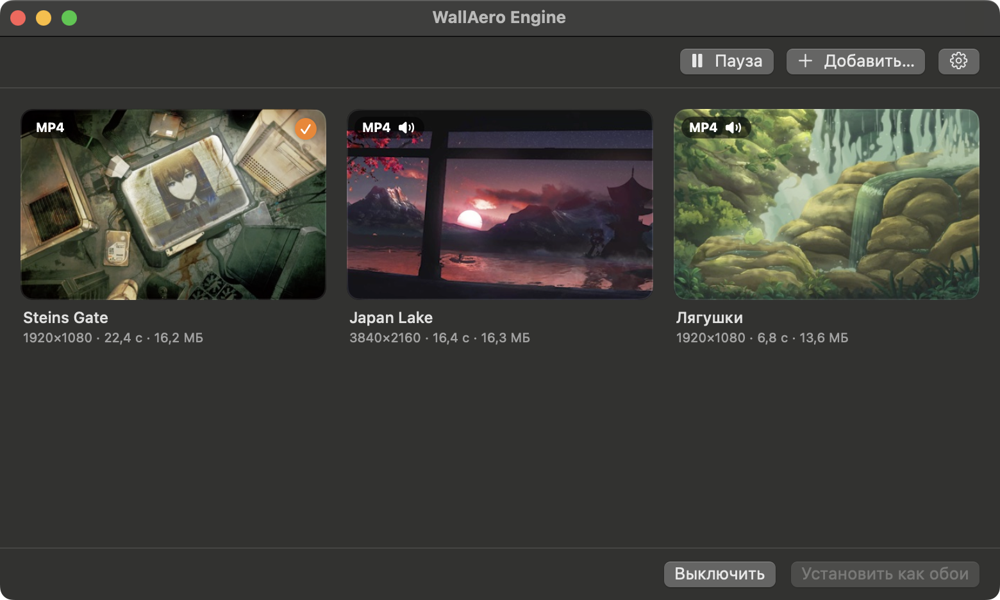
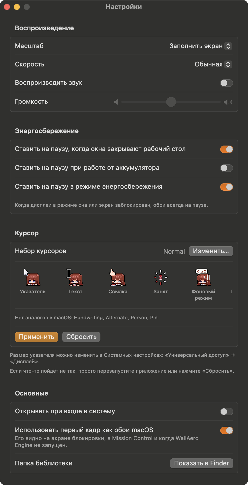

# WallAero Engine
[English](README.md) · **Русский**

Живые обои для macOS: видео, GIF и картинки на рабочем столе — под иконками и окнами, на всех рабочих столах (Spaces) и дисплеях. А ещё — анимированные курсоры из наборов для Windows.

<p align="center">
  
</p>

## Возможности

- **Форматы:** MP4, MOV, M4V (H.264/HEVC), GIF, APNG, анимированный WebP, HEICS, а также статичные PNG, JPEG, HEIC, WebP.
- **GIF и другие анимированные картинки** при импорте один раз перекодируются в H.264. Дальше они играют аппаратным декодером, как обычное видео, — это намного экономнее покадрового воспроизведения GIF. Маленькие GIF увеличиваются в целое число раз без сглаживания, поэтому пиксель-арт остаётся чётким.
- **Несколько дисплеев:** одни обои на все экраны или свои на каждый, можно выключить на отдельном дисплее.
- **Экономия энергии:** воспроизведение останавливается, когда рабочий стол полностью закрыт окнами или полноэкранным приложением, во время сна дисплеев и блокировки экрана. По желанию — от аккумулятора и в режиме энергосбережения. Видео не мешает дисплею засыпать.
- **Курсоры:** наборы курсоров для Windows (`.ani`, `.cur`) заменяют указатель во всей системе, вместе с анимацией. Какой файл какому состоянию соответствует, берётся из `install.inf` набора. Подробнее — в разделе [«Курсоры»](#курсоры).
- **Управление:** иконка в строке меню (пауза, следующие обои, быстрый выбор), окно библиотеки с drag-and-drop, «Открыть в программе → WallAero Engine» из Finder.
- **Настройки:** масштаб (заполнить / вписать / растянуть), скорость, звук и громкость, запуск при входе в систему, первый кадр как обычные обои macOS (виден на экране блокировки и в Mission Control).
- **Язык интерфейса** — русский или английский, выбирается по языку системы. Для остальных языков включается английский. Только для WallAero Engine язык можно сменить в «Системные настройки» → «Основные» → «Язык и регион» → «Приложения».

## Установка

Готовая сборка лежит в репозитории: [**скачать WallAeroEngine.zip**](https://github.com/M1nata1/AiWallpaper/raw/main/dist/WallAeroEngine.zip). Она подходит для Mac с Apple Silicon и Intel, нужна macOS 13 Ventura или новее.

1. Распакуйте архив и перетащите WallAero Engine в папку «Программы».
2. Откройте приложение. Оно не нотаризовано Apple, поэтому при первом запуске macOS его остановит и сообщит, что не может его проверить. Закройте это окно.
3. Откройте «Системные настройки» → «Конфиденциальность и безопасность», внизу нажмите «Все равно открыть» и подтвердите паролем. Это нужно сделать только один раз.

Раньше приложение называлось AiWallpaper. Если оно у вас стояло, просто откройте WallAero Engine: при первом запуске библиотека, настройки и резервные копии курсоров перенесутся сами. Затем снова включите «Открывать при входе в систему» в настройках и удалите старое приложение AiWallpaper.

Вместо шагов 2–3 можно снять карантин в Терминале — тогда приложение сразу откроется без предупреждения:

```bash
xattr -dr com.apple.quarantine "/Applications/WallAero Engine.app"
```

## Сборка из исходников

Нужен Xcode 15 или новее и macOS 13 Ventura или новее. С одними Command Line Tools (Swift 5.9+) универсальная сборка недоступна — используйте `--native`.

Готовое приложение универсальное: macOS сама запускает версию для своего процессора — Apple Silicon или Intel.

```bash
scripts/build.sh              # собрать "build/WallAero Engine.app" для Apple Silicon и Intel
scripts/build.sh --install    # собрать и скопировать в /Applications
scripts/build.sh --dist       # собрать и упаковать в dist/WallAeroEngine.zip — архив для скачивания
scripts/build.sh --native     # только для процессора этого Mac: вдвое быстрее, для разработки
swift test                    # тесты импорта, конвертации и чтения курсоров
scripts/screenshots.sh        # переснять скриншоты для README на обоих языках в docs/screenshots
```

Приложение подписывается ad hoc, поэтому собранное на этом Mac запускается сразу, без предупреждения.

## Как пользоваться

1. Запустите WallAero Engine — при первом запуске откроется пустая библиотека.
2. Перетащите в окно файлы или папки либо нажмите «Добавить…».
3. Двойной щелчок по обоям (или «Установить как обои») — и они на рабочем столе.

Дальше всё доступно из иконки в строке меню. При закрытом окне приложение не занимает место в Dock.

## Курсоры

<p align="center">
  
</p>

WallAero Engine ставит наборы курсоров, сделанные для Windows, — как Mousecape, только без ручной конвертации: `.ani` и `.cur` приложение переводит в формат macOS само.

1. Распакуйте набор в папку — обычно в ней лежат файлы `.ani` / `.cur` и `install.inf`.
2. Откройте «Настройки» → «Курсор» → «Выбрать папку…». Курсоры появятся в превью сразу с анимацией.
3. Нажмите «Применить» и подвигайте мышью.

Если в наборе есть `install.inf`, соответствие берётся из него. Поддерживаются оба распространённых вида: построчные записи в `[Wreg]` и общий список схемы (`Control Panel\Cursors\Schemes`). Без `install.inf` курсоры подбираются по именам файлов (`Normal`, `Text`, `Busy`, `Link`, `Help` и т. п.). Один курсор Windows может заменить сразу несколько курсоров macOS:

| Курсор в наборе | Где появится в macOS |
|---|---|
| `Arrow` | обычная стрелка |
| `IBeam` | текстовый курсор |
| `Hand` | рука над ссылками, стрелка создания псевдонима при перетаскивании |
| `Wait` | ожидание |
| `AppStarting` | стрелка с индикатором фоновой работы |
| `Crosshair` | прицел, в том числе при снимке экрана (⌘⇧4) |
| `No` | «нельзя» при перетаскивании |
| `SizeNS`, `SizeWE`, `SizeNWSE`, `SizeNESW` | изменение размера: края и углы окон, разделители, граница Dock |
| `SizeAll` | перемещение, раскрытая и сжатая рука |
| `Help` | стрелка со знаком вопроса |

Для `NWPen` (рукописный ввод), `UpArrow` (альтернативный выбор), `Person` и `Pin` аналогов в macOS нет: такие файлы перечислены под превью и не применяются.

Что стоит знать:

- Размер указателя задаётся штатно: «Системные настройки» → «Универсальный доступ» → «Дисплей» → «Размер указателя».
- macOS показывает не больше 24 кадров анимации курсора. Более длинные анимации равномерно прореживаются, длительность цикла сохраняется.
- Курсоры заменяются через недокументированный API CoreGraphics — тот же, которым пользуется Mousecape. Системные файлы не меняются, отключать SIP не нужно. Перед заменой оригиналы сохраняются, поэтому «Сбросить» возвращает именно их.
- Выбранный набор запоминается: после перезагрузки или нового входа в систему WallAero Engine применяет его снова при запуске. Если с курсором что-то не так, просто перезапустите приложение или нажмите «Сбросить».
- Если macOS сама вернёт стандартные курсоры, например после пробуждения или смены мониторов, WallAero Engine заметит это в течение нескольких секунд и снова поставит курсоры из набора.
- В macOS 26 стрелка и текстовый курсор берутся из новых системных курсоров (`ArrowS`, `IBeamS`). WallAero Engine заменяет и их, и прежние.
- Курсор-камера при снимке окна (⌘⇧4, затем пробел) остаётся системным: в наборах для Windows такого нет.

То же из терминала:

```bash
swift run cursorctl check "<папка>"   # показать, какой файл на какой курсор встанет, ничего не меняя
swift run cursorctl apply "<папка>"   # применить набор
swift run cursorctl status            # что применено сейчас
swift run cursorctl verify "<папка>"  # какие курсоры набора macOS подменила своими
swift run cursorctl reset             # вернуть системные курсоры
```

## Как это устроено

Для каждого дисплея создаётся окно без рамки на уровне рабочего стола (`kCGDesktopWindowLevel`): выше системных обоев, но ниже иконок Finder и обычных окон. Окно пропускает клики, присутствует на всех Spaces и не скрывается по ⌘H. Видео играет через `AVQueuePlayer` + `AVPlayerLooper` — бесшовный цикл без перезагрузки файла.

Курсоры регистрируются в WindowServer недокументированными функциями CoreGraphics (`CGSRegisterCursorWithImages` и соседними). Кадры `.ani` извлекаются из вложенных `.cur` в самом крупном разрешении и передаются одной вертикальной лентой — в таком виде WindowServer принимает анимированный курсор.

```
Sources/
  WallpaperCore/          импорт, конвертация GIF → H.264, превью, библиотека (без UI, покрыто тестами)
  CursorCore/             чтение .ani/.cur и install.inf, применение и сброс курсоров (покрыто тестами)
  CGSCursor/              объявления недокументированного API курсоров для Swift (C)
  cursorctl/              утилита командной строки для курсоров
  WallAeroEngine/
    Engine/               окна рабочего стола, плееры, логика паузы
    UI/                   строка меню, окно библиотеки, настройки (SwiftUI)
    AppDelegate.swift     запуск, главное меню, открытие файлов
    ScreenshotMode.swift  съёмка скриншотов для README (--screenshots)
Tests/                    тесты WallpaperCore и CursorCore
Resources/                Info.plist, иконка, переводы
scripts/                  сборка .app, генерация иконки, скриншоты
docs/screenshots/         скриншоты для README: en/ и ru/
dist/                     готовая сборка для скачивания (scripts/build.sh --dist)
```

Библиотека хранится в `~/Library/Application Support/WallAeroEngine`: импортированные файлы — копии, оригиналы можно перемещать и удалять. Там же, в `CursorBackup`, лежат сохранённые системные курсоры.

Журнал воспроизведения:

```bash
log stream --predicate 'subsystem == "com.fadevec.WallAeroEngine"'
```

## Ограничения

- WebM, MKV и AVI macOS не воспроизводит штатно — сконвертируйте в MP4 (H.264 или HEVC), например через HandBrake.
- На экране блокировки живые обои не играют: macOS не даёт сторонним приложениям показывать там своё содержимое. Вместо них виден первый кадр, если включено «Использовать первый кадр как обои macOS».
